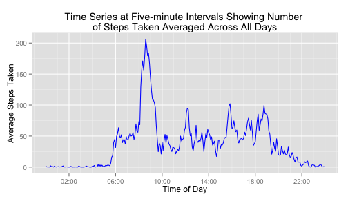
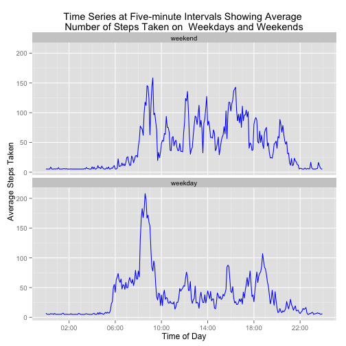

## Loading and preprocessing the data

Here is the URL for the source data .zip archive:


```r
sourceDataZipURL <- 
    "https://d396qusza40orc.cloudfront.net/repdata/data/activity.zip"
```

Download the .zip archive if it's not alreadly available locally.


```r
zipFile <- basename(sourceDataZipURL)
if (!file.exists(zipFile)) {
    download.file(sourceDataZipURL, zipFile, method = "curl")
}
```

Name of the file to extract from the .zip archive.


```r
sourceDataFile <- "activity.csv"
```

Extract the data file from the .zip archive, and load the data, using
read.csv, from the data file into a dplyr data frame tbl.


```r
library(dplyr)
data_1 <- tbl_df(read.csv(unz(zipFile, sourceDataFile)))
str(data_1)
```

```
## Classes 'tbl_df', 'tbl' and 'data.frame':	17568 obs. of  3 variables:
##  $ steps   : int  NA NA NA NA NA NA NA NA NA NA ...
##  $ date    : Factor w/ 61 levels "2012-10-01","2012-10-02",..: 1 1 1 1 1 1 1 1 1 1 ...
##  $ interval: int  0 5 10 15 20 25 30 35 40 45 ...
```

Let's convert the date variable, currently of class factor, into class date.


```r
data_1$date <- as.Date(data_1$date)
```

And lets add a new variable that identifies the day of week for each date.


```r
data_1 <- data_1 %>%
          mutate("day_of_week" = as.factor(weekdays(date)))

str(data_1)
```

```
## Classes 'tbl_df', 'tbl' and 'data.frame':	17568 obs. of  4 variables:
##  $ steps      : int  NA NA NA NA NA NA NA NA NA NA ...
##  $ date       : Date, format: "2012-10-01" "2012-10-01" ...
##  $ interval   : int  0 5 10 15 20 25 30 35 40 45 ...
##  $ day_of_week: Factor w/ 7 levels "Friday","Monday",..: 2 2 2 2 2 2 2 2 2 2 ...
```

Now the dataset is ready to be explored. 

## What is mean total number of steps taken per day?

In order to ignore the NAs for this part of the assignment, it would be
helpful to know where they are.  We'll look for NAs in each of the steps,
date, and interval variables.


```r
any(is.na(data_1$steps))
```

```
## [1] TRUE
```

```r
any(is.na(data_1$date))
```

```
## [1] FALSE
```

```r
any(is.na(data_1$interval))
```

```
## [1] FALSE
```

Only the steps variable contains NAs.

Now let's see if the observations associated with the dates containing NAs 
are all NAs or if they have some non-missing step counts.


```r
data_1 %>%
filter(is.na(steps)) %>%
group_by(date) %>%
summarize(total_NAs = sum(is.na(steps)))
```

```
## Source: local data frame [8 x 2]
## 
##         date total_NAs
## 1 2012-10-01       288
## 2 2012-10-08       288
## 3 2012-11-01       288
## 4 2012-11-04       288
## 5 2012-11-09       288
## 6 2012-11-10       288
## 7 2012-11-14       288
## 8 2012-11-30       288
```

We see that there are eight dates with 288 missing step counts each.

Now we'll see how many total intervals are associated with each date.


```r
interval_counts_by_date <- data_1 %>%
                           group_by(date) %>%
                           summarize(interval_count = sum(!is.na(interval)))

unique(interval_counts_by_date$interval_count) 
```

```
## [1] 288
```

Using "!is.na(interval)" in the dplyr command chain above is a simple way of
counting the number of intervals for each date, since we already know there
are no NA values in the interval column.  Since the unique command returned
only one value, every date has exactly 288 intervals.  That means that for
dates with missing step counts, *all* step counts are missing.

So now that we know where the NAs are in the data,  we'll pick a reasonable
technique for ignoring them.  Using a chain of dplyr commands, we'll find the
total number of steps for each date. We'll let the NAs propagate in the
summarize command.  If we chose to set na.rm=TRUE in the summarize command,
we'd be setting the total_steps value to zero rather than NA for those dates,
which would artifically lower the mean and median calculations in the next
steps.  I think that would incorrectly introduce error into the mean and
median counts of total steps per day, since they are missing and we don't
know that they would be zero.  When we  make the histogram, ggplot will by
default ignore the propagated NA values.


```r
total_steps_by_date_1 <- data_1 %>%
                         group_by(date) %>%
                         summarize(total_steps = sum(steps, na.rm = FALSE))
```


Make a histogram of the total number of steps taken each day.


```r
binwidth_val = round(max(total_steps_by_date_1$total_steps, na.rm=TRUE)/30)
title_text <- "Histogram of Total Steps Taken Each Day"
title_text <- paste(title_text, "\n(Missing Values Ignored)")

library(ggplot2)
g <- ggplot(total_steps_by_date_1, aes(x=total_steps, fill="salmon"))
g <- g + geom_histogram(binwidth=binwidth_val)
g <- g + labs(x = "Total Steps", y = "Count")
g <- g + labs(title = title_text)
g <- g + theme(legend.position="none")
plot(g)
```

 

Now we'll calculate the mean and median total number of steps per day.  We'll
ignore the eight dates with total_steps values that are set to NA.


```r
mean_total_steps_by_day_1 <- mean(total_steps_by_date_1$total_steps, 
                                  na.rm = TRUE)
print(mean_total_steps_by_day_1)
```

```
## [1] 10766.19
```

```r
median_total_steps_by_day_1 <- median(total_steps_by_date_1$total_steps, 
                                      na.rm = TRUE)
print(median_total_steps_by_day_1)
```

```
## [1] 10765
```

The **mean** total number of steps per day is 
**10766.19**.

The **median** total number of steps per day is 
**10765**.


## What is the average daily activity pattern?

Find the average number of steps for each interval across all dates, sorted
in descending order of average step count.


```r
mean_steps_by_interval <- data_1 %>%
                          group_by(interval) %>%
                          summarize(mean_steps = mean(steps, na.rm=TRUE)) %>%
                          arrange(desc(mean_steps))
```

Make a time series plot of the five-minute interval (x-axis) and the average
number of steps taken, averaged across all days (y-axis).


```r
g <- ggplot(mean_steps_by_interval, aes(x=interval, y = mean_steps))
g <- g + geom_line(color = "blue")
g <- g + labs(x = "Interval", y = "Average Steps Taken")
title_text <- "Time Series of the Five-minute Intervals"
title_text <- paste(title_text, "\nShowing Average Number of Steps Taken")
g <- g + labs(title = title_text)
plot(g)
```

 

The interval with the maximum average number of steps is at the top of
the sorted data frame.


```r
interval_with_max_number_of_average_steps <- mean_steps_by_interval$interval[1]
print(interval_with_max_number_of_average_steps)
```

```
## [1] 835
```

```r
max_number_of_average_steps <- mean_steps_by_interval$mean_steps[1]
print(max_number_of_average_steps)
```

```
## [1] 206.1698
```

So the 5-minute interval, on average across all the days in the
dataset, which contains the maximum number of steps is interval 
number **835** with 
**206** steps.

## Imputing missing values

Find the total number of rows with missing values.


```r
total_rows_with_missing_values <- sum(is.na(data_1))
```

**Strategy for the imputation of missing data:**

Recall that we showed that each date that is missing step counts is actually
missing all the counts for that day.  So it seems reasonable to replace the
missing counts with the averages for that day.  We'll create a new data set
where for every interval that is missing a step count, we'll replace the
missing value with the mean for that day of the week.


```r
mean_steps_by_day_of_week <- data_1 %>%
                             group_by(day_of_week) %>%
                             summarize(mean_steps = mean(steps, na.rm=TRUE))

data_2 <- data_1
for (i in 1:nrow(data_1)) {
    if (is.na(data_2$steps[i])) {
        data_2$steps[i] <- (
            mean_steps_by_day_of_week$mean_steps[
                mean_steps_by_day_of_week$day_of_week == data_2$day_of_week[i]
            ]
        )
    }
}
```

With the missing step counts replaced, make a histogram of the total number
of steps taken each day for the case with imputed missing values.


```r
total_steps_by_date_2 <- data_2 %>%
                         group_by(date) %>%
                         summarize(total_steps = sum(steps))

binwidth_val = round(max(total_steps_by_date_2$total_steps, na.rm=TRUE)/30)
title_text <- "Histogram of Total Steps Taken Each Day"
title_text <- paste(title_text, "\n(Missing Values Imputed)")

g <- ggplot(total_steps_by_date_2, aes(x=total_steps, fill="salmon"))
g <- g + geom_histogram(binwidth=binwidth_val)
g <- g + labs(x = "Total Steps", y = "Count")
g <- g + labs(title = title_text)
g <- g + theme(legend.position="none")
plot(g)
```

 

With the imputed values in place, we'll now find the mean and median total 
number of steps per day and the change from the estimates without the imputed
values.


```r
mean_total_steps_by_day_2 <- mean(total_steps_by_date_2$total_steps)
print(mean_total_steps_by_day_2)
```

```
## [1] 10821.21
```

```r
mean_total_steps_by_day_percent_change <-
    ((mean_total_steps_by_day_2 - mean_total_steps_by_day_1)/
     mean_total_steps_by_day_1) * 100
print(mean_total_steps_by_day_percent_change)
```

```
## [1] 0.5110529
```

```r
median_total_steps_by_day_2 <- median(total_steps_by_date_2$total_steps)
print(median_total_steps_by_day_2)
```

```
## [1] 11015
```

```r
median_total_steps_by_day_percent_change <- 
    ((median_total_steps_by_day_2 - median_total_steps_by_day_1) / 
     median_total_steps_by_day_1) * 100 
print(median_total_steps_by_day_percent_change)
```

```
## [1] 2.322341
```

With the imputed values, the **mean** total number of steps per day is now
**10821.21**, 
which is a change of 
**0.51%**
compared with the previous value of
**10766.19**.

With the imputed values, the **median** total number of steps per day is now 
**11015**,
which is a change of 
**2.32%**
compared with the previous value of
**10765**.

## Are there differences in activity patterns between weekdays and weekends?

We'll create a new factor variable in the dataset with two 
levels -- "weekday" and "weekend".


```r
data_2 <- data_2 %>%
          mutate("day_type" = 
              ifelse(
                  ((day_of_week == "Sunday") | (day_of_week == "Saturday")),
                  "weekend",
                  "weekday"
              )
          )
data_2$day_type = as.factor(data_2$day_type)
```

Reverse the default factor order for day_type, putting "weekend" before
"weekday".


```r
new_order = c("weekend", "weekday")
data_2$day_type <- 
    factor(data_2$day_type, levels = new_order)

str(data_2)
```

```
## Classes 'tbl_df', 'tbl' and 'data.frame':	17568 obs. of  5 variables:
##  $ steps      : num  34.6 34.6 34.6 34.6 34.6 ...
##  $ date       : Date, format: "2012-10-01" "2012-10-01" ...
##  $ interval   : int  0 5 10 15 20 25 30 35 40 45 ...
##  $ day_of_week: Factor w/ 7 levels "Friday","Monday",..: 2 2 2 2 2 2 2 2 2 2 ...
##  $ day_type   : Factor w/ 2 levels "weekend","weekday": 2 2 2 2 2 2 2 2 2 2 ...
```

Now we'll find the average number of steps for each interval across all 
weekdays and across all weekend days .


```r
mean_steps_by_interval_by_day_type <- data_2 %>%
                                      group_by(day_type, interval) %>%
                                      summarize(mean_steps = mean(steps))
```

Make a panel plot containing a time series plot of the 5-minute interval
(x-axis) and the average number of steps taken, averaged across all weekday
days or weekend days (y-axis).


```r
title_text <- "Time Series of the Five-minute Intervals Showing Average"
title_text <- paste(title_text, "\nNumber of Steps Taken on")
title_text <- paste(title_text, " Weekdays and Weekends")

g <- ggplot(mean_steps_by_interval_by_day_type, aes(x=interval, y = mean_steps))
g <- g + geom_line(color = "blue")
g <- g + facet_wrap(~ day_type, nrow = 2, ncol = 1)
g <- g + labs(x = "Interval", y = "Average Steps Taken")
g <- g + labs(title = title_text)
plot(g)
```

 
